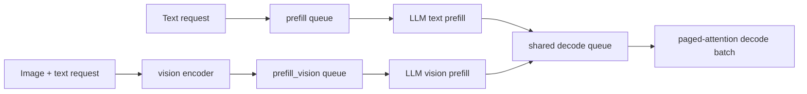
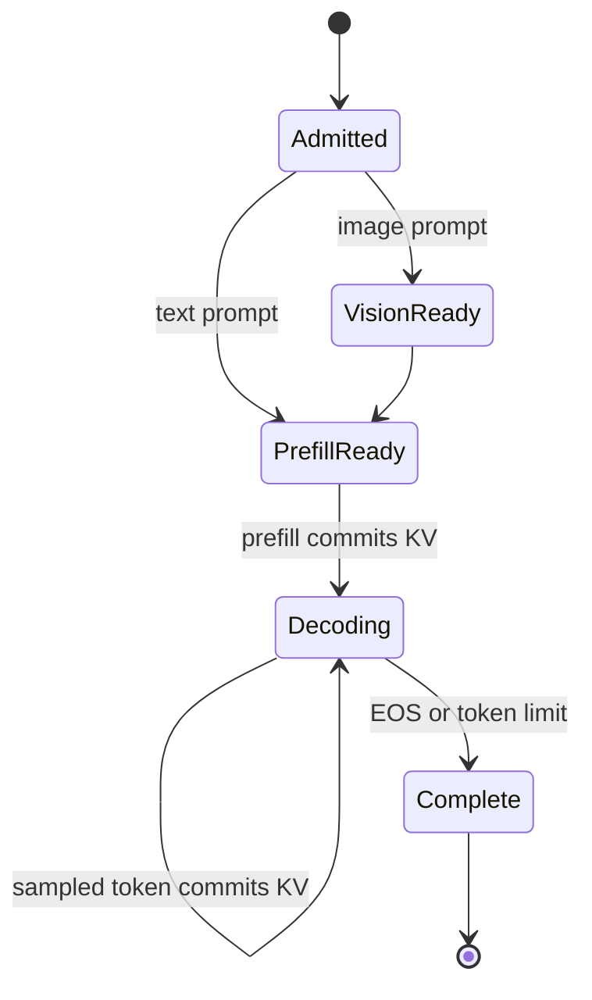
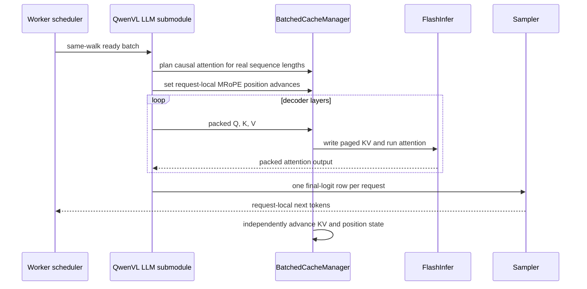

# PR 1 design: continuous batching and paged attention

Status: design + integration harness + gate tests. Runtime changes are limited
to same-walk batching guards on the QwenVL LLM submodule (`can_batch` /
`preprocess` homogeneity, `get_needed_cache_labels`, explicit eager-only
`get_cuda_graph_configs`) and two bug fixes surfaced by the harness (see
§Evidence). The acceptance verdict is produced by
`benchmark/qwenvl_acceptance.py batch` on a CUDA + FlashInfer host; CPU runs of
the same suites are a harness dry run, not acceptance.

## Purpose

Issue [#127](https://github.com/mstar-project/mstar/issues/127) requires a
large Qwen VLM to run on MStar's paged-attention and continuous-batching path.
PR 1 defines the acceptance contract that follows the PR-0 single-GPU
correctness baseline. It must not be interpreted as evidence that batching is
already accepted.

## Supported batching boundary

MStar batches one `(node_name, graph_walk)` at a time. QwenVL has separate
`prefill` and `prefill_vision` graph walks, so the first supported contract is:

- text-prefill requests batch with text-prefill requests;
- image-prefill requests batch with image-prefill requests after their vision
  stage;
- text-origin and image-origin requests converge on the `decode` walk and can
  batch there.

Directly packing a text `prefill` input beside an image `prefill_vision` input
does not prove scheduler-level co-batching because the scheduler never forms
that cross-walk batch.



## Request-state ownership



Each request owns its page table, KV sequence length, MRoPE position advance,
sampling/penalty state, loop count, and prefill-only visual features. A packed
batch may concatenate tensors but must never merge that ownership.

## Attention backend contract

FlashInfer remains the attention owner. QwenVL owns Q/K/V projections, QK norm,
and MRoPE; `BatchedCacheManager` owns causal masking, GQA KV-head mapping,
page placement, variable lengths, scaling, and attention execution. This PR
does not introduce a custom Triton attention kernel.

The real-engine tests must cover these externally observable risks:

| Risk | Required proof |
| --- | --- |
| GQA head mapping | QwenVL paged result matches a dense SDPA reference |
| Causal masking | Perturbing future K/V cannot change an earlier token |
| Final page boundary | Non-page-aligned request lengths match isolated execution |
| Packed layout | Variable-length batch outputs match per-request outputs |
| Request isolation | Changing one request's image, length, or sampler does not affect another |
| CUDA graph replay | Eager and captured output match whenever capture is enabled (PR 1: capture is **not** enabled, see §CUDA graphs) |

### Homogeneity guard (WS-D)

`QwenVLLLMSubmodule.can_batch` returns True only for a homogeneous batch
(`qwenvl_batch_is_homogeneous`): on `prefill` no request carries vision
tensors; on `prefill_vision` every request carries both `vision_embeds` and
`deepstack_visual_embeds`; on `decode` every request is a single token.
`KVCacheEngine` routes a non-homogeneous group to `_execute_sequential`, and
`preprocess` raises on it, so a text/vision mix can never be packed into one
launch. `forward`/`forward_batched` additionally refuse vision or DeepStack
tensors on any walk other than `prefill_vision`, so decode never re-injects a
request's image.

### CUDA graphs (P1-G6 decision)

PR 1 takes **option A: eager-only**. `QwenVLLLMSubmodule.get_cuda_graph_configs`
returns `[]` explicitly and `test_pr1_scope_is_eager_only_no_cuda_graph_capture`
pins it. The LLM forward still has host synchronisations and data-dependent
shapes (`int(image_mask.sum())`, embedding `clone` + masked scatter, DeepStack
injection) that would break capture. Enabling capture is a follow-on that must
ship with eager-vs-replay parity evidence and flip this section.

## Execution path



## Required integration tests

1. Enter through the real worker scheduler and KV cache engine, not a direct
   `preprocess` call.
2. Compare eager batched prefill and decode against isolated requests at batch
   sizes 2, 4, and 8.
3. Cover variable lengths around KV page boundaries.
4. Co-schedule a text-origin and an image-origin request in the common decode
   walk and compare every greedy token to isolated decode.
5. Exercise completion, cancellation, and page reuse without stale KV leakage.
6. If CUDA graphs are enabled, compare every captured shape with eager output;
   otherwise explicitly retain eager-only operation.

## Acceptance gates

| Gate | Pass condition |
| --- | --- |
| P1-G1 | Each claimed batch shape is observed through the real scheduler |
| P1-G2 | Batched outputs match isolated outputs within declared tolerance |
| P1-G3 | No cache, visual, sampler, or output cross-request contamination |
| P1-G4 | Page lifecycle releases and safely reuses storage |
| P1-G5 | GQA, causal, variable-length, and page-boundary cases pass |
| P1-G6 | CUDA-graph parity passes or eager-only scope is documented |

## Evidence

### Harness

| Piece | File | Role |
| --- | --- | --- |
| Engine harness | `test/integration/qwenvl_harness.py` | Builds a tiny QwenVL LLM on the real resource-pool `Engine`: `KVSpec`/`KVManager`, `AttentionSpec`/`FlashInferManager`, position and sampler resources, and `LocalTransferEngine`. `run_prefill`/`run_decode` enter through `prepare_inputs → exec_and_postprocess → finalize_batch`; the isolated reference is the same engine's per-request fallback. A test-local SDPA attention *resource* consumes the production KV plan/pages to independently oracle FlashInfer without introducing a runtime compatibility path |
| Worker harness | `test/integration/qwenvl_worker_harness.py` | In-process `WorkerGraphsManager` + `MicroScheduler` (production default round-robin policy) + the current single resource-pool `EngineManager` over QwenVL's real graph walks, with the conductor's NEW_REQUEST / WORKER_GRAPHS_DONE / decode-loop transitions replayed inline; records every batch at the scheduler and at resource-engine entry (`lm_head` launch count + rows) |
| Evidence collector | `benchmark/qwenvl_acceptance.py batch` | Runs the suites below and folds per-test outcomes into a per-gate verdict JSON (Integration rows = `cuda-flashinfer-bf16` parametrisations; `cpu-dense-fp32` rows are reported as dry run) |

Every engine/worker test is parametrised over two targets. Only the CUDA row
is acceptance evidence:

| Target id | Device / backend / dtype | Evidence label |
| --- | --- | --- |
| `cuda-flashinfer-bf16` | CUDA, resource-pool `FlashInferManager`, bf16 (`-m cuda`) | **Integration** |
| `cpu-dense-fp32` | CPU, test-local SDPA attention resource over production KV pages, fp32 | Component (harness dry run) |

Tolerance: fp32 rows must match to `rtol=atol=1e-5`; bf16 FlashInfer rows use
`rtol=1e-2, atol=2e-2` on last-token logits (Qwen3-Omni CUDA-graph precedent),
and a greedy stream may diverge only at a step whose reference top-2 margin is
within that noise band. Sampling is greedy throughout the parity tests.

### FlashInfer CUDA test geometry

The CPU dry-run model retains `head_dim=8` for fast local coverage. The CUDA
FlashInfer target widens only its synthetic test configuration to
`head_dim=64`, `hidden_size=128`, and MRoPE sections `[8,12,12]`; its vision
output width follows the same 128-wide text state. This is required because the
Orin SM87 FlashInfer 0.6.18 JIT rejects 8/16/32-dimensional heads while a
64-dimensional head executes successfully. It is not a production model
configuration: the selected Qwen3-VL checkpoint uses head dimension 128.

### Gate → tests

| Gate | Suite | Cases |
| --- | --- | --- |
| P1-G1 | `test_qwenvl_scheduler_batching.py` | text prefill co-batch B∈{2,4,8} then shared decode; `prefill_vision` co-batch B∈{2,4} after a batched vision-encoder step; text + image requests prefill on separate walks then share one decode batch; late arrival prefills alone and joins the running decode batch; engine sees exactly the scheduled id set for every batch. Every co-batched stream is compared with the same request alone on a fresh worker |
| P1-G2 | `test_qwenvl_batched_engine.py` | Resource-engine packed `forward_batched` versus its per-request execution fallback on identical weights: text prefill B∈{2,4,8}, `prefill_vision` B∈{2,4} with different grids, decode B∈{2,4,8}, image-origin decode B∈{2,4,8}, mixed text/image-origin decode (plus a literal alone-on-a-fresh-engine cross-check) |
| P1-G3 | `test_qwenvl_lifecycle.py` | perturb one request's image grid / image features / prompt length / sampler in a B=4 batch, other three unchanged; per-request sampler config and seen-token state, hot vs greedy rows on identical prompts |
| P1-G4 | `test_qwenvl_lifecycle.py` | `remove_request` frees pages and sampler state, others keep KV; cancel mid-decode (engine and worker) with survivors matching the reference; pool fill → free → readmit onto recycled pages equals a fresh engine; worker completion by token limit and by EOS; late arrivals refused pages are held by the scheduler and admitted on recycled pages once the first wave completes |
| P1-G5 | `test_qwenvl_attention_parity.py` | incremental decode = one-shot prefill at 127/128/129/257 tokens (page_size 128); causal: prefix hidden states unchanged by an appended suffix or a second packed request; unequal-length packed batches = isolated; FlashInfer vs dense reference on the same device for prefill + 3 decode steps at B=3 (page boundary), B=4 (16/64/100/128), B=8 (mixed), and `prefill_vision` with two grids; GQA precondition on the tiny config |
| P1-G6 | `test/modular/qwenvl/test_continuous_batch_serving.py::test_pr1_scope_is_eager_only_no_cuda_graph_capture` | pins `get_cuda_graph_configs() == []` (option A, documented above) |

Negative checks were run against the harness while building it (not kept as
tests): disabling the reference causal mask fails the causal test; reading a
request's history from the wrong page order fails the page-boundary test.

### Test matrix

| Case | Walk | B | Lengths / notes | Test | Gates |
| --- | --- | --- | --- | --- | --- |
| Text prefill parity | `prefill` | 2, 4, 8 | 16 .. 100 tokens, varied per row | `test_qwenvl_batched_engine.py::test_text_prefill_batched_matches_sequential` | G2, G5 |
| Page boundary | `prefill` → `decode` | 1 | 127, 128, 129, 257 (page_size 128) | `test_qwenvl_attention_parity.py::test_incremental_decode_matches_one_shot_prefill_across_page_boundary` | G5 |
| Page boundary, packed | `prefill` | 3, 4, 8 | (127, 128, 129), (16, 64, 100, 128), mixed 1 .. 257 | `test_qwenvl_attention_parity.py::test_flashinfer_prefill_and_decode_match_dense_reference` | G5 |
| Variable-length packing | `prefill` | 4 | unequal lengths in one launch = each alone | `test_qwenvl_attention_parity.py::test_packed_variable_length_batch_matches_isolated_requests` | G5 |
| Vision prefill parity | `prefill_vision` (LLM node) | 2, 4 | different image grids / visual-token counts | `test_qwenvl_batched_engine.py::test_vision_prefill_batched_matches_sequential`, `test_qwenvl_attention_parity.py::test_flashinfer_vision_prefill_matches_dense_reference` | G2, G5 |
| Decode parity | `decode` | 2, 4, 8 | text-origin and image-origin streams | `test_qwenvl_batched_engine.py::test_decode_batched_matches_sequential`, `::test_decode_batch_of_image_origin_requests_matches_sequential` | G2 |
| Mixed-origin decode | `decode` | 2 | text-only + image-origin after their own prefills; every greedy token vs alone | `test_qwenvl_batched_engine.py::test_mixed_origin_decode_batch_matches_sequential`, `test_qwenvl_scheduler_batching.py::test_text_and_image_requests_prefill_separately_then_share_decode` | G1, G2, G3 |
| GQA correctness | all | 3, 4, 8 | FlashInfer vs dense SDPA with explicit head-group expansion; tiny config asserted GQA | `test_flashinfer_*_match*_dense_reference`, `test_tiny_config_exercises_gqa` | G5 |
| Causal mask | `prefill` | 1 → 2 | appended suffix / second packed request leaves prefix hidden states unchanged | `test_qwenvl_attention_parity.py::test_causal_mask_future_tokens_do_not_change_past_hidden_states` | G5 |
| Request isolation | `decode` | 4 | perturb one request's grid / image features / length / sampler | `test_qwenvl_lifecycle.py::test_perturbing_one_request_leaves_co_batched_requests_unchanged`, `::test_sampler_state_is_per_request` | G3 |
| Complete + remove | `decode` | 4 | token limit and EOS; `remove_request` returns pages and sampler state | `test_qwenvl_lifecycle.py::test_remove_request_returns_pages_and_clears_all_per_request_state`, `::test_worker_completion_by_token_limit_frees_pages_and_state`, `::test_worker_completion_by_eos_stops_the_decode_loop_early` | G4 |
| Cancel mid-flight | `decode` | 4 | drop one rid, survivors match the reference | `test_qwenvl_lifecycle.py::test_cancel_mid_decode_does_not_disturb_remaining_requests`, `::test_worker_cancel_mid_decode_frees_pages_and_others_match_isolated` | G4 |
| Page reuse | `prefill` + `decode` | many | fill pool → free → readmit on recycled pages = fresh engine; late arrivals held on OOM then admitted | `test_qwenvl_lifecycle.py::test_recycled_pages_carry_no_stale_kv`, `::test_worker_late_arrivals_that_do_not_fit_are_held_then_admitted_on_recycled_pages` | G4 |
| Scheduler observation | all | 2, 4, 8 | batch shape asserted at `MicroScheduler.get_next_batch` and at engine entry | `test_qwenvl_scheduler_batching.py::test_scheduler_co_batches_text_prefill_and_decode`, `::test_scheduler_co_batches_vision_prefill`, `::test_late_arrival_prefills_alone_then_joins_the_running_decode_batch`, `::test_engine_observes_exactly_the_scheduled_request_set` | G1 |
| CUDA graph | `decode` / `prefill` | — | eager-only (option A); `get_cuda_graph_configs() == []` | `test_continuous_batch_serving.py::test_pr1_scope_is_eager_only_no_cuda_graph_capture` | G6 |

### Bugs surfaced by the harness (fixed elsewhere)

- `QwenVLModel.get_partition_forward_pass_args` (inherited from PR 0) built
  `unpersist_tensors` with `sum(edge.tensor_info, start=[])` over
  `TensorPointerInfo` objects, so the very first prefill → decode transition
  raised `TypeError` on the conductor. The list-pass fix and regression live
  on PR 0 (`mstar-project/mstar#233`).
- `MicroScheduler._select_node_priority` returned the *last iterated* node name
  instead of the highest-priority one, so under the PRIORITY policy a batch with
  both a KV node and a stateless node ready produced a `(node, walk)` pair with
  no members and the worker idled forever. Production uses the round-robin
  default and was unaffected. Resource pools (#228) deleted PRIORITY, so this
  path is gone on current `main` and no separate platform PR is needed.

### Platform observation (not changed)

When a single prefill batch's combined page footprint exceeds the pool, the
worker holds the whole batch and retries it unchanged, so it never fits unless
CPU offload is enabled. The conductor's admission cap is what prevents this in
production; the P1-G4 oversubscription test therefore admits the excess
requests only after the first wave is decoding. Target-scale page budgeting
remains a PR 1 non-goal.

### Status

| Gate | CPU dry run (`cpu-dense-fp32`) | CUDA FlashInfer (`cuda-flashinfer-bf16`) |
| --- | --- | --- |
| P1-G1 | 8/8 pass | 0/8 collected |
| P1-G2 | 12/12 pass | 0/12 collected |
| P1-G3 | 5/5 pass | 0/5 collected |
| P1-G4 | 7/7 pass | 0/7 collected |
| P1-G5 | 7/7 pass (dense-reference rows) + GQA config precondition | 0/11 collected (4 FlashInfer-vs-reference rows are CUDA-only) |
| P1-G6 | pass (Component + this document) | n/a — eager-only |

Counts are what `benchmark/qwenvl_acceptance.py batch --allow-cpu-only` reports
on a CUDA-less host; the collector marks every CUDA gate `not collected` until
the `-m cuda` rows run.

The harness is deliberately ported to the resource-pool engine rather than
retaining imports from the removed `mstar.engine.kv_store`, `cache_manager`, or
`kv_cache_engine` modules. This keeps the CUDA acceptance run on the same
execution architecture that production QwenVL uses.

PR 1 is merge-ready only when the CUDA column is collected green on the
qualifying GPU:

```bash
# CPU dry run of the harness (not acceptance)
uv run --extra qwenvl --extra dev pytest -q test/modular/qwenvl test/integration/test_qwenvl_*.py

# PR1 acceptance (CUDA + FlashInfer required); emits the per-gate JSON
uv run --extra qwenvl --extra dev pytest -q test/integration/test_qwenvl_*.py -m cuda
uv run --extra qwenvl --extra dev python benchmark/qwenvl_acceptance.py batch \
  --skip-cpu-rows --output qwenvl-batch-evidence.json
```

The tiny-config CUDA run proves the engine/scheduler contract; it does not
exercise the 30B checkpoint (P0-G2/P0-G6 evidence is collected separately and
is not subsumed by PR 1).

## Non-goals

- Tensor parallelism and TP2 parity.
- Target-scale memory fit.
- Performance comparison.
- Same-launch mixed text/image **prefill** without a separately approved
  graph-normalization design.
