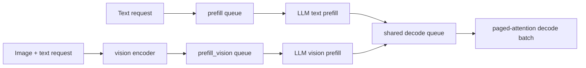
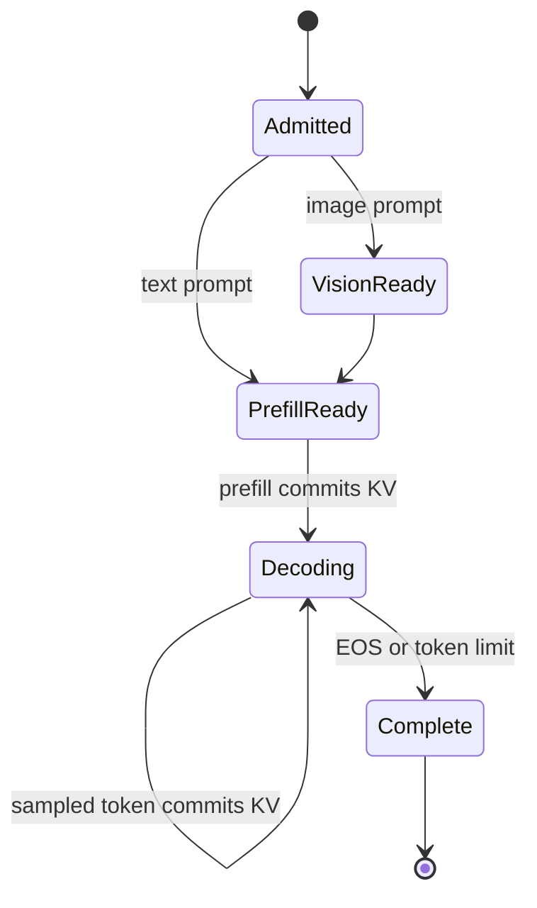
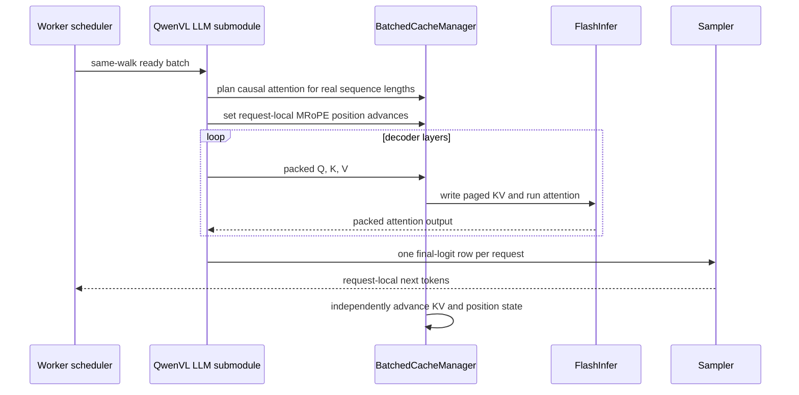

# PR 1 design: continuous batching and paged attention

Status: design-only stack slice. This PR changes no QwenVL runtime code.

## Purpose

Issue [#127](https://github.com/mstar-project/mstar/issues/127) requires a
large Qwen VLM to run on MStar's paged-attention and continuous-batching path.
PR 1 defines the acceptance contract that follows the PR-0 single-GPU
correctness baseline. It must not be interpreted as evidence that batching is
already accepted.

## Supported batching boundary

MStar batches one `(node_name, graph_walk)` at a time. QwenVL has separate
`prefill` and `prefill_vision` graph walks, so the first supported contract is:

- text-prefill requests batch with text-prefill requests;
- image-prefill requests batch with image-prefill requests after their vision
  stage;
- text-origin and image-origin requests converge on the `decode` walk and can
  batch there.

Directly packing a text `prefill` input beside an image `prefill_vision` input
does not prove scheduler-level co-batching because the scheduler never forms
that cross-walk batch.

## Request-state ownership

Each request owns its page table, KV sequence length, MRoPE position advance,
sampling/penalty state, loop count, and prefill-only visual features. A packed
batch may concatenate tensors but must never merge that ownership.

## Attention backend contract

FlashInfer remains the attention owner. QwenVL owns Q/K/V projections, QK norm,
and MRoPE; `BatchedCacheManager` owns causal masking, GQA KV-head mapping,
page placement, variable lengths, scaling, and attention execution. This PR
does not introduce a custom Triton attention kernel.

The real-engine tests must cover these externally observable risks:

| Risk | Required proof |
| --- | --- |
| GQA head mapping | QwenVL paged result matches a dense SDPA reference |
| Causal masking | Perturbing future K/V cannot change an earlier token |
| Final page boundary | Non-page-aligned request lengths match isolated execution |
| Packed layout | Variable-length batch outputs match per-request outputs |
| Request isolation | Changing one request's image, length, or sampler does not affect another |
| CUDA graph replay | Eager and captured output match whenever capture is enabled |

## Execution path

## Required integration tests

1. Enter through the real worker scheduler and KV cache engine, not a direct
   `preprocess` call.
2. Compare eager batched prefill and decode against isolated requests at batch
   sizes 2, 4, and 8.
3. Cover variable lengths around KV page boundaries.
4. Co-schedule a text-origin and an image-origin request in the common decode
   walk and compare every greedy token to isolated decode.
5. Exercise completion, cancellation, and page reuse without stale KV leakage.
6. If CUDA graphs are enabled, compare every captured shape with eager output;
   otherwise explicitly retain eager-only operation.

## Acceptance gates

| Gate | Pass condition |
| --- | --- |
| P1-G1 | Each claimed batch shape is observed through the real scheduler |
| P1-G2 | Batched outputs match isolated outputs within declared tolerance |
| P1-G3 | No cache, visual, sampler, or output cross-request contamination |
| P1-G4 | Page lifecycle releases and safely reuses storage |
| P1-G5 | GQA, causal, variable-length, and page-boundary cases pass |
| P1-G6 | CUDA-graph parity passes or eager-only scope is documented |

## Non-goals

- Tensor parallelism and TP2 parity.
- Target-scale memory fit.
- Performance comparison.
- Same-launch mixed text/image **prefill** without a separately approved
  graph-normalization design.
