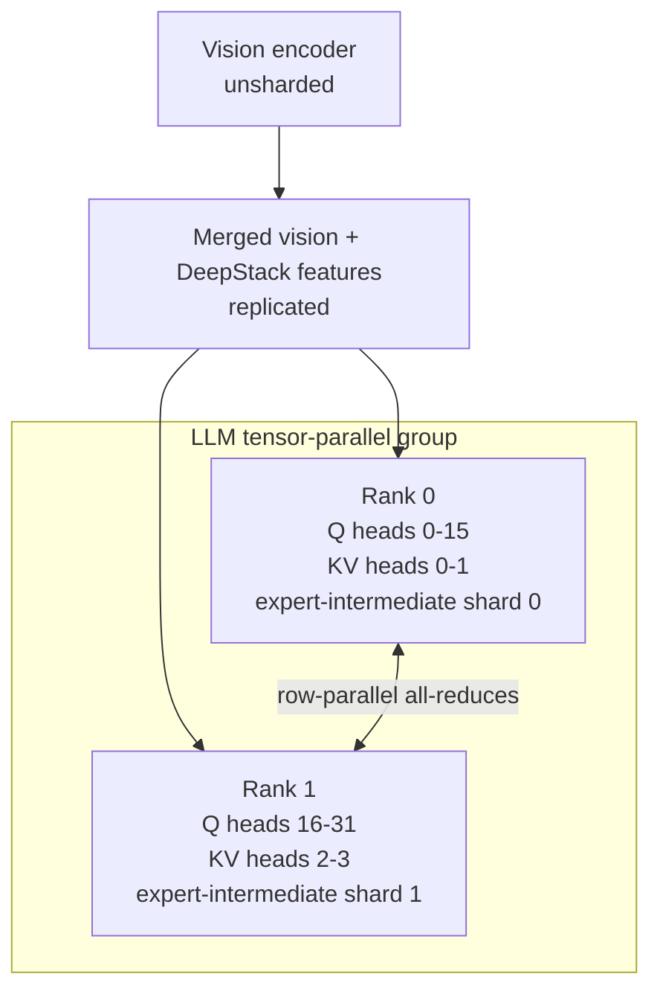
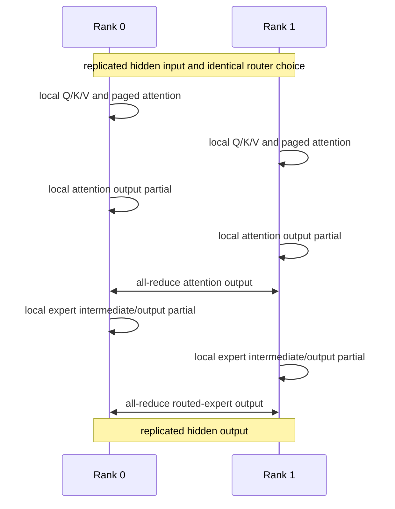

# PR 2 design: tensor-parallel QwenVL

Status: design-only stack slice. TP topology exists in the repository but
TP2-vs-TP1 numerical acceptance does not yet exist.

## Purpose

Issue [#127](https://github.com/mstar-project/mstar/issues/127) explicitly
requires a large VLM to exercise sharding. PR 2 defines the tensor-parallel
contract and the evidence required before any TP topology becomes the QwenVL
default.

## Topology

Vision remains unsharded until profiling proves it is the limiting component.
Its language-width outputs are replicated to the LLM ranks.

## Local-shard contract for Qwen3-VL-30B-A3B

| Tensor or operation | Global shape | TP2 local contract |
| --- | --- | --- |
| Q projection | 32 heads × 128 | 16 Q heads per rank |
| K/V projections | 4 heads × 128 | 2 KV heads per rank |
| Attention output projection | 4096 → 2048 | row-sharded input, one all-reduce |
| Expert gate/up | `[128, 2048, 1536]` published | 384 gate + 384 up channels per expert/rank in execution layout |
| Expert down | `[128, 768, 2048]` published | corresponding 384-intermediate slice plus one all-reduce |
| Token embedding and LM head | 151936 vocabulary rows | vocabulary shards; logits gathered before sampling |
| KV cache | 4 KV / 32 Q heads | 2 KV / 16 Q heads per rank |

Every partition must be exact. Unsupported degrees or dimensions fail at
startup; no implicit head/expert padding is allowed.

## Per-layer communication

The router is replicated. A rank disagreement in selected experts is a
correctness failure before the expert collective, not numerical noise.

## Weight-loading proof

Use value-encoded, non-symmetric source tensors to prove every rank receives
the intended checkpoint region:

1. Q/K/V rank slices and GQA mapping;
2. independent gate and up slices across the fused boundary;
3. matching down-projection intermediate slice;
4. vocabulary embedding/head slices;
5. loader attachment survives `to_empty` and dtype conversion;
6. union of rank slices reconstructs the published tensor exactly.

Shape-only checks are insufficient.

## TP2-vs-TP1 harness

Add `test/distributed/test_qwenvl_tp2_vs_tp1.py` with a two-run artifact flow:

1. run the accepted TP1 server and save immutable checkpoint/processor
   revisions, processed input hashes, greedy token IDs, chosen logit rows, and
   decoded output;
2. run `configs/qwenvl_tp2.yaml` on the same GPU/software stack;
3. replay exactly the saved cases and compare.

Required cases: text-only, one image, two images, mixed-origin decode after
PR-1 batching, and page-boundary request lengths.

| Comparison | Required use |
| --- | --- |
| Tensor | Last-token logits within documented BF16/NCCL tolerance |
| Token | Identical greedy token IDs for each fixed generation |
| Text | Identical decoded output after special-token handling |
| Smoke | Debugging aid only; never a TP acceptance substitute |

## Acceptance gates

| Gate | Pass condition |
| --- | --- |
| P2-G1 | LLM ranks form one TP group; vision is not accidentally executed twice |
| P2-G2 | Value-encoded tests prove every shard and loader path |
| P2-G3 | Router choices align and every row-parallel output is reduced once |
| P2-G4 | Projection and FlashInfer KV-cache local-head geometries agree |
| P2-G5 | All fixed cases pass tensor, token, and text parity |
| P2-G6 | Invalid TP degree/divisibility fails early with a useful diagnostic |

Only after P2-G1 through P2-G6 pass may `mstar serve qwenvl` promote to a TP
configuration.

## Triton boundary

TP MoE uses the real fused Triton expert path, including top-k reduction and
the subsequent NCCL all-reduce. Its CUDA behavior must be tested on the target
environment. Attention remains FlashInfer-owned; this PR does not justify a
parallel custom attention kernel.
