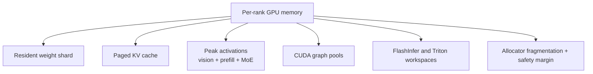
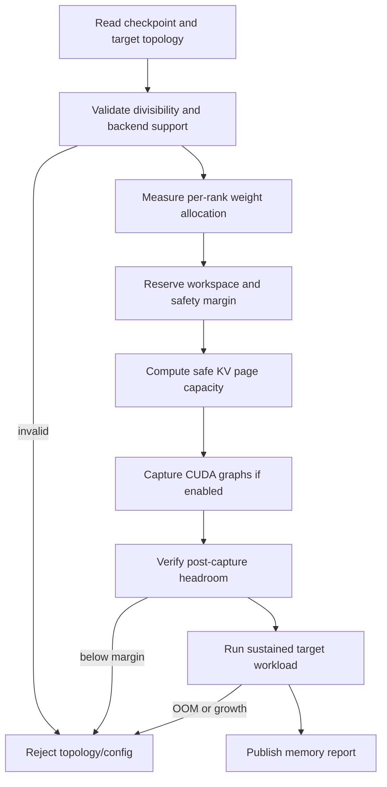

# PR 3 design: target-scale memory planning

Status: design-only stack slice. No target topology or scale acceptance result
exists yet.

## Purpose

Issue [#127](https://github.com/mstar-project/mstar/issues/127) calls out the
new surface as 72B-class VLM size and asks that reusable sharding or
memory-planning gaps be surfaced. PR 3 defines a controlled admission process
for real target hardware; it is not a smoke-launch checklist.

## Scale decision

`Qwen/Qwen3-VL-30B-A3B-Instruct` has roughly 31B resident parameters, despite
3B activated parameters per token. Before this slice can satisfy #127, record
one of these explicit choices:

1. amend the issue target to this checkpoint with a replacement hardware-stress
   criterion; or
2. treat it as bring-up and repeat this slice on a genuinely 72B-class
   checkpoint.

Neither active-MoE count nor a successful small context launch establishes
resident-memory acceptance.

## Memory ownership model



The startup planner owns capacity. An advertised `max_seq_len` is not a
resident-context claim unless it is backed by pages, workspace headroom, and
the verified workload.

For BF16 self-attention cache per rank:

```text
KV bytes = layers × pages × page_size × 2(K,V)
           × local_kv_heads × head_dim × 2 bytes
```

At TP2 Qwen3-VL-30B-A3B has two local KV heads. At higher TP degrees, MStar's
GQA replication behavior means memory does not necessarily scale as `1 / TP`.

## Admission sequence



No model component may independently take “remaining memory.” Page capacity,
graph capture, and required safety margin are one owner’s budget.

## Required hardware/workload record

Record immutable checkpoint revision, GPU model/count/memory, interconnect,
driver, CUDA, Torch, FlashInfer, Triton, TP degree, vision placement, target
context, image mix/resolution, concurrent requests, output length, and required
headroom on every rank.

Measure at these boundaries:

1. process initialized;
2. checkpoint loaded;
3. KV cache allocated;
4. vision prefill peak;
5. largest accepted prefill peak;
6. post-CUDA-graph capture;
7. steady-state decode at each target concurrency;
8. after completion, cancellation, and page reuse.

## Workload matrix

| Workload | Required signal |
| --- | --- |
| Cold one-image launch | weight, vision, and first-JIT peak |
| Largest accepted image count/resolution | vision activation peak |
| Longest accepted prompt/context | prefill and KV residency |
| Target concurrent decode | operational batch capacity |
| Repeated admit/finish/cancel | page leak and fragmentation behavior |
| 30-minute sustained run | delayed OOM and reserved-memory slope |

## Required artifact

Publish a machine-readable report with git SHA/dirty state, checkpoint revision,
full environment fingerprint, exact YAML/environment overrides, per-rank memory
boundaries, workload seeds, maximum admitted pages/concurrency, failed/OOM
attempts, sustained-run duration/slope, and reproduction commands.

## Acceptance gates

| Gate | Pass condition |
| --- | --- |
| P3-G1 | Checkpoint/topology satisfy the explicitly approved scale target |
| P3-G2 | Every rank loads and allocates without transient or steady OOM |
| P3-G3 | Post-capture free memory meets the agreed margin on every rank |
| P3-G4 | Target workload sustains without allocation failure |
| P3-G5 | Churn returns pages/memory to a stable baseline |
| P3-G6 | Complete reproducible report is published |

## Non-goals

- Inflating YAML context length without resident capacity.
- Reducing the agreed workload until it passes and calling that acceptance.
- Treating a one-off smoke launch as sustained operability.
