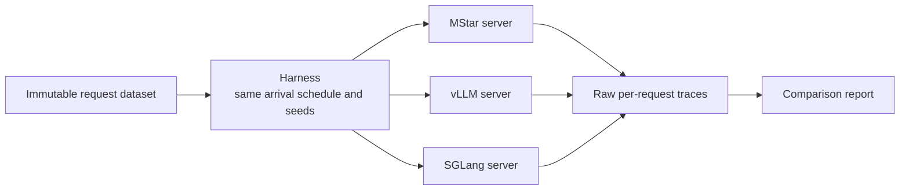
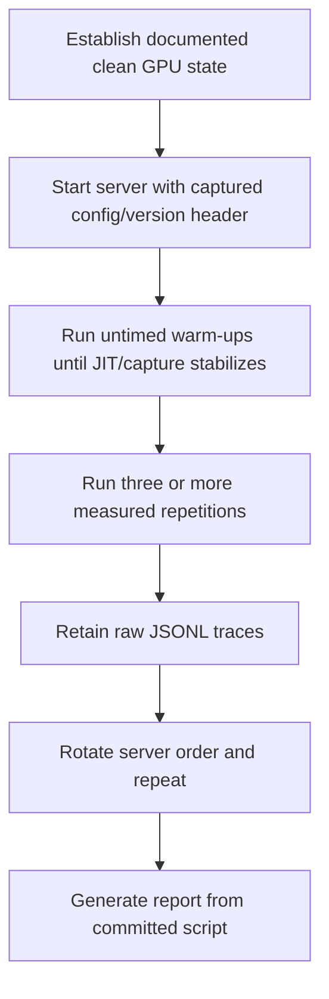

# PR 4 design: comparative performance acceptance

Status: design-only stack slice. No comparative benchmark result exists yet.

## Purpose

Issue [#127](https://github.com/mstar-project/mstar/issues/127) requires a
performance comparison against vLLM or SGLang for the same model. PR 4 defines
the reproducible experiment that follows correctness, batching, TP, and
target-scale memory acceptance.

## Controlled comparison topology

If a baseline cannot serve the chosen checkpoint, record the exact unsupported
feature or version blocker. Do not substitute a different checkpoint, processor,
precision, or workload and call it equivalent.

## Equality controls

Every compared run uses the same:

- immutable checkpoint and processor/tokenizer revision;
- GPU model/count, rank placement, interconnect, driver, and power mode;
- precision and quantization setting;
- tokenized prompts, processed pixel tensors, output length, and sampling
  parameters;
- concurrency/arrival schedule, warm-up count, and measurement duration.

Run a fixed correctness corpus before collecting timings. A faster incorrect
server is not a valid result.

## Workload matrix

| Dimension | Required points |
| --- | --- |
| Modality | text-only, one image, multi-image |
| Prompt length | short, medium, long accepted context |
| Image workload | representative and maximum accepted resolution/count |
| Output | short completion and sustained decode |
| Concurrency | 1, 2, 4, 8, then agreed saturation |
| Traffic | closed-loop throughput and open-loop arrivals |

Dataset ordering is immutable and published. Timeouts, OOMs, and errors remain
in the report denominator.

## Required metrics

Collect per request and aggregate distributions:

- time to first token: p50, p90, p99;
- inter-token latency: p50, p90, p99;
- end-to-end latency: p50, p90, p99;
- input/output tokens per second and requests per second;
- peak allocated/reserved GPU memory per rank;
- error, timeout, and OOM rate;
- achieved concurrency and scheduler queue time;
- separate preprocessing, vision, prefill, and decode time where available.

## Run protocol

1. Capture exact launch command, config, and software header.
2. Use untimed warm-ups to absorb first-use compilation/capture.
3. Save raw request traces for every repetition.
4. Verify GPU process/memory cleanup after each server.
5. Rotate server order to reduce thermal/order bias.
6. Regenerate all report tables/figures from the raw traces using committed
   tooling.

## Report contract

The report includes absolute values, repetition spread, methodology, failures,
input manifest, configs, hardware/software versions, and raw artifacts. A
single relative “X% faster” headline is not sufficient.

## Acceptance gates

| Gate | Pass condition |
| --- | --- |
| P4-G1 | All servers pass the fixed correctness corpus |
| P4-G2 | Checkpoint, precision, hardware, inputs, and semantics match |
| P4-G3 | Harness, dataset manifest, configs, versions, and commands are published |
| P4-G4 | All workload points and failure rates are reported |
| P4-G5 | Raw traces are retained and summaries regenerate from them |
| P4-G6 | Result/limitations are attached to the upstream #127 PR or issue |

## Non-goals

- Tuning by changing output correctness or the accepted workload.
- Comparing BF16 MStar with a quantized baseline without a separately labeled
  experiment.
- Omitting failure requests from throughput/latency accounting.
- Calling CPU tests or kernel intuition a performance result.
